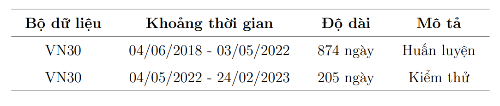
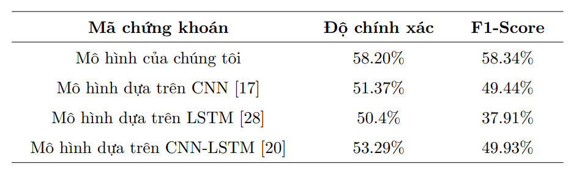

# Xây dựng mô hình học tăng cường trong hoạt động đầu tư tài chính

## 1. Giới thiệu
Bài toán tập trung ở đây là dự đoán xu hướng giá của cổ phiếu. Cách tiếp cận truyền thống là sử dụng Học giám sát với các mô hình CNN, LSTM, GNN để dự đoán đầu ra là xu hướng giá. Những năm gần đây, RL (Reinforcement Learning) đã được sử dụng rất nhiều trong tài chính như tối ưu quản lý danh mục đầu tư hay xây dựng chiến lược giao dịch tự động. Ở dự án này, tôi sẽ dùng RL để giải bài toán này.

## 2. Cấu trúc thư mục
Cấu trúc thư mục của dự án như sau:
- **agents**: định nghĩa agent của một mô hình RL
- **configs**: tùy chỉnh config
- **data**: chứa dữ liệu huấn luyện và kiểm thử
- **data_loaders**: tiền xử lý dữ liệu
- **environments**: mô phỏng lại môi trường giao dịch
- **executors**: định nghĩa cách huấn luyện mô hình
- **notebooks**: chứa notebook sử dụng trong dự án
- **results**: lưu trữ kết quả huấn luyện và kiểm thử
- **utils**: chứa các files khác

## 3. Cài đặt và Hướng dẫn sử dụng
### 3.1 Clone repository:
```bash
git clone https://github.com/Dratasy/Reinforcement-Learning-in-Securities.git
cd Reinforcement-Learning-in-Securities
```
### 3.2 Cài đặt dependencies
```bash
conda env create -f environment.yml
```
### 3.3 Chạy dự án:
```bash
python main.py
```
## 4. Thực nghiệm và kết quả
### 4.1 Tập dữ liệu
Bộ dữ liệu được sử dụng cho thực nghiệm là dữ liệu cổ phiếu VN30. Dữ liệu chia làm hai phần dành cho hai tập huấn
luyện và kiểm thử. Chi tiết độ dài của dữ liệu của mỗi tập như sau:




### 4.2 Kết quả thí nghiệm
Tiến hành thí nghiệm đo độ chính xác và F1-Score với tập kiểm thử của VN30. Thí nghiệm sẽ được lặp lại 30 lần tương ứng
với 30 mã chứng khoán của VN30. Giá trị độ chính xác và F1-Score trung bình của mô hình như sau:



Chi tiết cách xử lý dữ liệu, mô hình huấn luyện, và kết quả chi tiết của toàn bộ 30 mã, vui lòng xem [báo cáo chi tiết đính kèm](https://github.com/Dratasy/Reinforcement-Learning-in-Securities/blob/main/thesis_report.pdf) 

